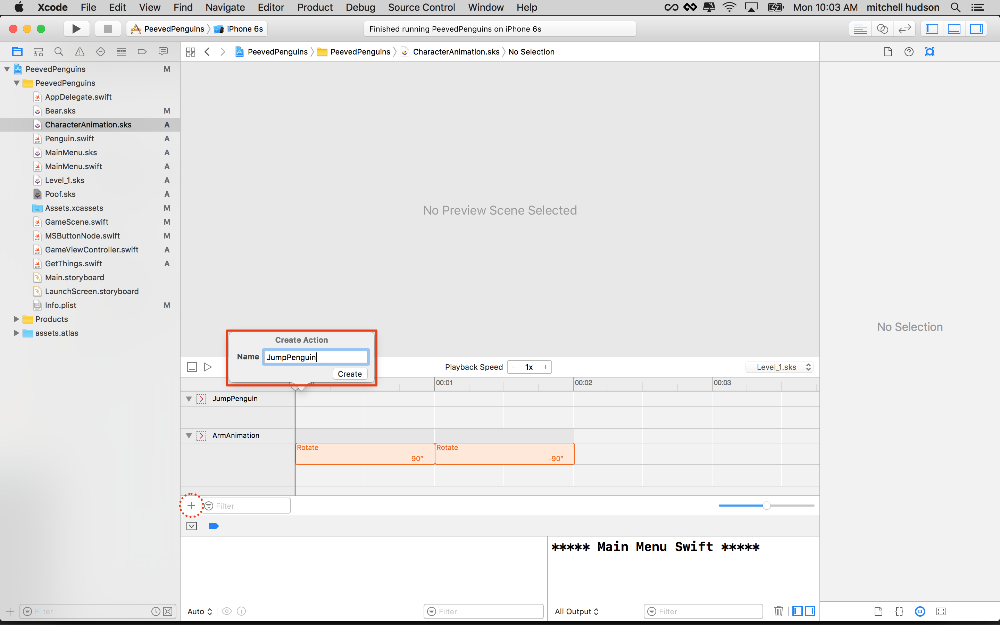
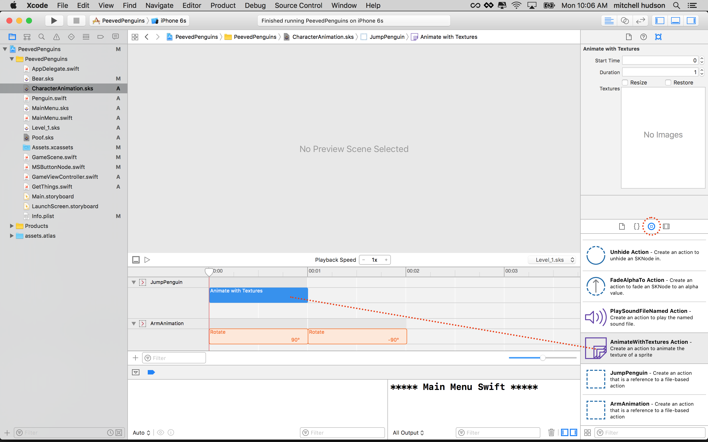
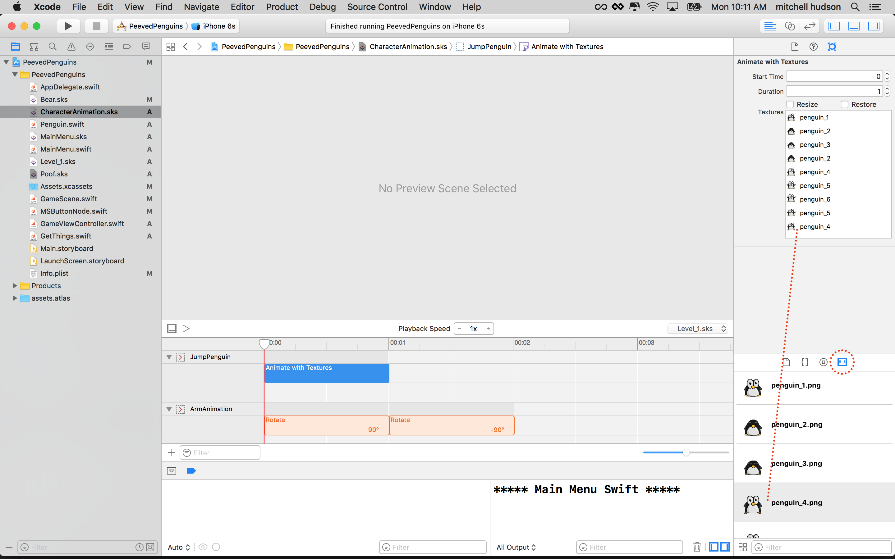
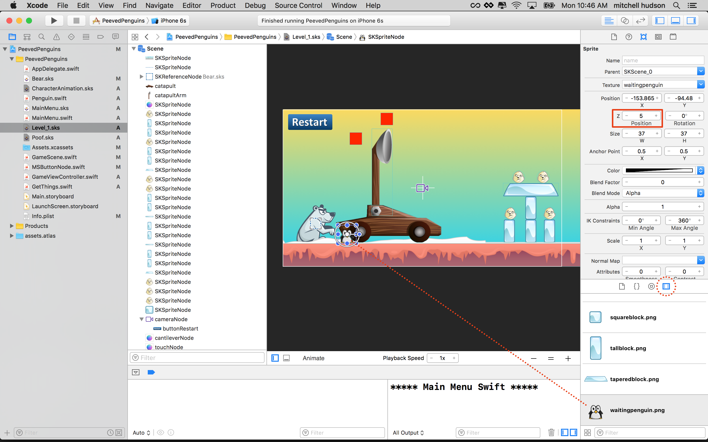
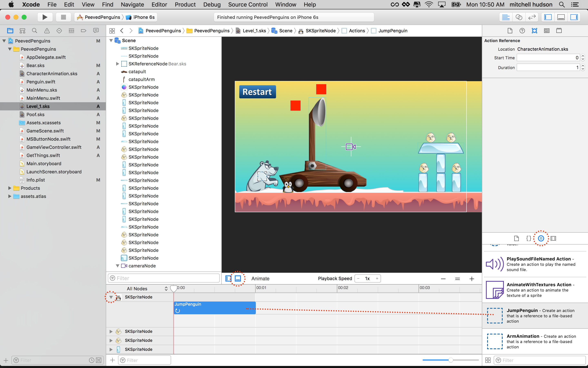
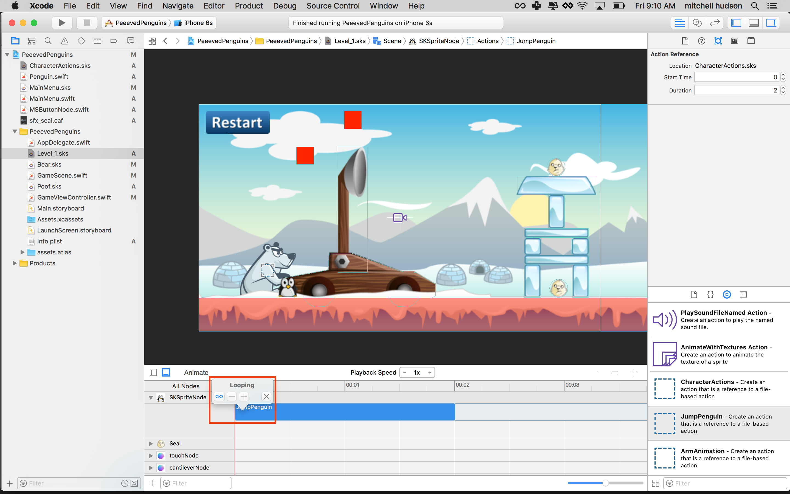

In an early chapter you already learned how to create an animation using the timeline 
features of SpriteKit (remember the bear?). In this chapter you will learn how to create 
a sprite frame animation, using a series of sprite files. You will animate penguins to 
sit around the catapult, waiting for their turn to make history and fly.

# Penguin animation action

You're going add this new penguin animation action to the *CharacterActions.sks*.

> [action]
> Select *CharacterActions.sks* in the project outline and add a new action by clicking 
> the `+`, name it `JumpPenguin`.
>
> 
>

## Setup the animation

> [action]
> The first thing you need to do is drag the *AnimateWithTextures* action into the 
> timeline.
> 
> 
>

SpriteKit allows you to sequence the animation frames by dropping them into the 
*Textures* box.

The order for this animation will be *penguin_#* `1,2,3,2,4,5,6,5,4`.

> [action]
> Drag each of the *penguin_#.png* assets into the texture box in the order above.
> Set *duration* to `2`
>
> It should look like this when you're finished.
> 
>

Great, you've made a `JumpPenguin` action. Time to apply this to the *GameScene*

# Adding Penguins

> [action]
> Drag a *waitingpenguin.png* to the *Level_1.sks* and set *Z-Position* to `5`.
>
> 
>
> Expand the timeline for this sprite and drag in the `JumpAction` action into the 
> timeeline.
>
> 
>
> You will want to repeat the animation forever so set this action repeat to forever.
>
> 
>
> *Copy* and *Paste* this penguin two more times.
>

Run your game... You should see the three penguins blinking and jumping for joy next to 
the catapult:

# Unsynchronize the animations

The animation looks pretty good. However, it seems unnatural that all three penguins 
perform the `JumpAction` at the exact same time. This happens because our timeline 
actions all start at zero, this means the animation starts as soon as the object enters 
the scene.

You improve this quite easily, click on each *JumpAction* in the timeline and modify 
the *Start Timer*, set it to `0` , `0.25` and `0.5` respectivley.

Run your game...

# Summary

Well done! You now have mastered sprite frame animations in SpriteKit.

In the next chapter you are going to polish the gameplay.
