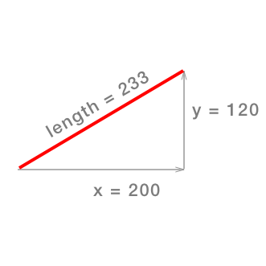

Currently a player can only shoot once. The camera will follow the flying penguin, but 
won't scroll back to the catapult when the attempt is completed. You are going to that 
in this chapter.

# Reset the camera

When a Penguin flies off the screen or comes to rest on the screen we need to move the camera back over 
to the catapult to be ready to launch the next Penguin. It's good to break our code into functions that 
we can reuse so you will write a function to handle this. 

> [action]
> Add a new function to the `GameScene` class:
>
```
func resetCamera() {
    /* Reset camera */
    let cameraReset = SKAction.move(to: CGPoint(x:0, y:camera!.position.y), duration: 1.5)
    let cameraDelay = SKAction.wait(forDuration: 0.5)
    let cameraSequence = SKAction.sequence([cameraDelay,cameraReset])
    cameraNode.run(cameraSequence)
    cameraTarget = nil
}
```
>

This function creates a new move action that moves the camera to (x: 0, y: 0). This should be 
center of the left half of the screen. That is if the anchor point of the screen is in the center. 
If not you can check the initial location of the camera and use those coordinates.

Next we define a wait action. 

Then there is sequence action. This combines the wait and the move. 

Last we run the sequence on the camera. So the effect, when you call `resetCamera()` is wait
half a second, then move back to the starting position. 

At the very end we set the `cameraTarget` is set to `nil` since we aren't following that object 
any more. 

# Removing Penguins

It is possible for a Penguin to fly off the screen. In this case we want to remove it from the 
world. If it isn't visible we don't want the physics engine to keep track of it. 

> [action]
> Add a new function. 
> 
```
func remove(penguin: Penguin) {
    penguin.removeFromParent()
    cameraTarget = nil
}
```
>

# Checking on the penguin

If a penguin has stopped or is moving slowly we will remove `cameraTarget` and move the 
camera back to the catapult and reset the catapult arm itself. This is trick 

You will have to check if this condition becomes *true* on a regular basis, where do 
you think this check should be made?

Also if a penguin falls below the edge of the screen it has fallen out of the world
and should be removed, and the camera reset. 

# Implementing the first check

To check the speed of the penguin we need to look at it's motion in both the x and y. 
The speed is a combination of both. The penguin has a velocity x and y. If we picture 
this as a right triangle the distance moved is the length of the hypotenuse.



Using the Pythagorean Theorem you can find the length. 

`length = sqrt((x*x)+(y*y))`

We can make this more conveneient to calculate by writing an extension to the CGVector
class. 

> [action]
> Add the following *outside* the GameScene class. You can put it at the bottom of the 
> file where you defined `clamp` earlier. 
> 
```
extension CGVector {
    public func length() -> CGFloat {
        return CGFloat(sqrt(dx*dx + dy*dy))
    }
}
```
>
> The extension adds a new method to CGVector. This method returns a CGFloat which is the 
> length of the vector. 
> 

> [action]
<<<<<<< HEAD
> Add the following code after the camera clamp in `func update(_ currentTime:)`
>
```
/* Check penguin has come to rest */
if cameraTarget.physicsBody?.joints.count == 0 && cameraTarget.physicsBody?.velocity.length() < 0.18 {
>
    cameraTarget.removeFromParent()
>
    /* Reset catapult arm */
    catapultArm.physicsBody?.velocity = CGVector(dx:0, dy:0)
    catapultArm.physicsBody?.angularVelocity = 0
    catapultArm.zRotation = 0
>
    /* Reset camera */
    let cameraReset = SKAction.moveTo(CGPoint(x:284, y:camera!.position.y), duration: 1.5)
    let cameraDelay = SKAction.waitForDuration(0.5)
    let cameraSequence = SKAction.sequence([cameraDelay,cameraReset])
>
    camera?.runAction(cameraSequence)
}
```

While this may look a little complicated at first, what actually is going on is only a 
tiny bit of math. You want to check whether the **speed** of the penguin has come to 
reset (or near rest).

The *length* function that calculates the square length of the velocity (basically the 
x and y component of the speed combined).

There is an issue with this check, it works well once the penguin has been launched. 
However, when the penguin is being pulled back on the catapult it will have a **speed** 
or *length* less than the limit of `0.18`.

You can use `cameraTarget.physicsBody?.joints.count` to check if the penguin has been 
fired.

The **cameraTarget** will point to the penguin and while the penguin it is attached to 
the catapultArm there will be a joint attached to it, giving the  **joint.count** a 
value of `1`.  This is a quick way to check this, another slightly more involved way 
would be to use another property to track the *State* of the penguin. e.g. `Loading, 
Launched`

> [challenge]
> I omitted another scenario here, what if the penguin somehow leaves the borders of 
> the game scene? How would you check if the penguins position was out of the *GameScene*
>

# Reset the camera

You may have noticed another slight Ux issue here, what if the player tries to launch 
another penguin before the camera has scrolled all the way back.?

This can be corrected by stopping the *moveTo* action that's being applied to the camera, let's do this when a new penguin becomes attached to the catapult.

> [action]
> Add the following code to `touchesBegan(...)`, just before:
>
```
cameraTarget = penguin
```
>
```
/* Remove any camera actions */
cameraNode.removeAllActions()
```
>

## Final tweak

<<<<<<< HEAD
Let's get rid of the red box static nodes, an easy way to hide them using the editor is 
to modify the *Z-Position* to `-2` e.g. behind the background.  The visibility of a 
physics node has no effect on the physics simulation. Otherways to achieve this could 
be setting the sprite to have an *alpha* of `0` or set *hidden* to be `true`.
=======
Let's get rid of the red box static nodes, an easy way to hide them using the editor is to modify the *Z-Position* to `-2` e.g. behind the background.  The visibility of a physics node has no effect on the physics simulation. Other ways to achieve this could be setting the sprite to have an *alpha* of `0` or set *hidden* to be `true`.
>>>>>>> MakeSchool-Tutorials/master

# Summary

You've learned the importance of making those **little touches**, it's often the small 
things when added together that can really take your game play to the next level and 
make the experience more memorable for the player.

Always look for ways to improve your game mechanic and make it feel as satisfying as 
possible for the player. Get feedback and iterate.

In the next chapter where you will learn how you can make your game iPad compatible!
