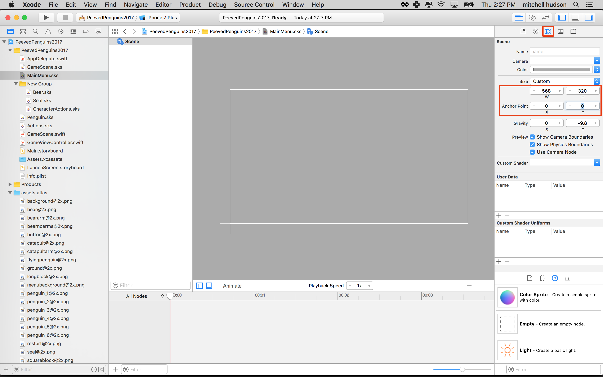
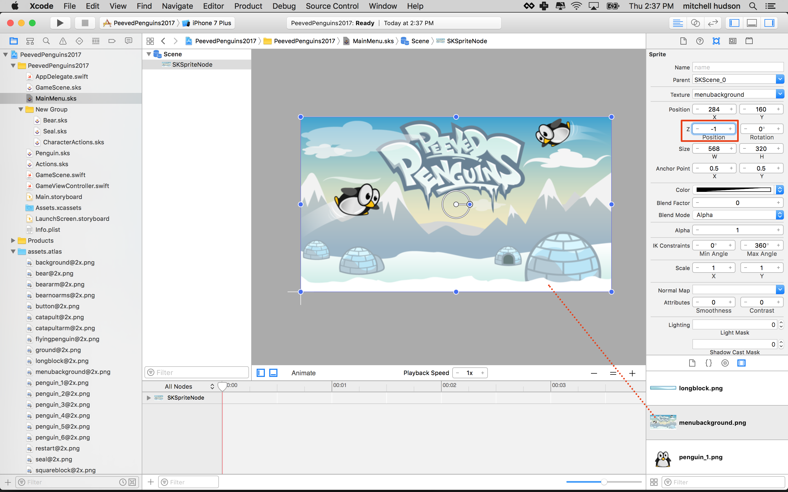
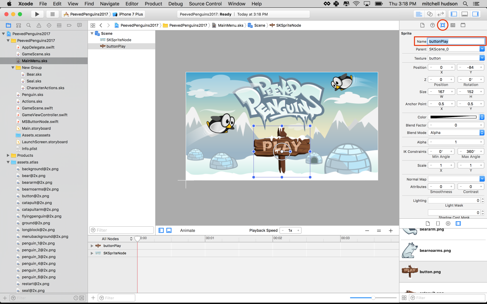
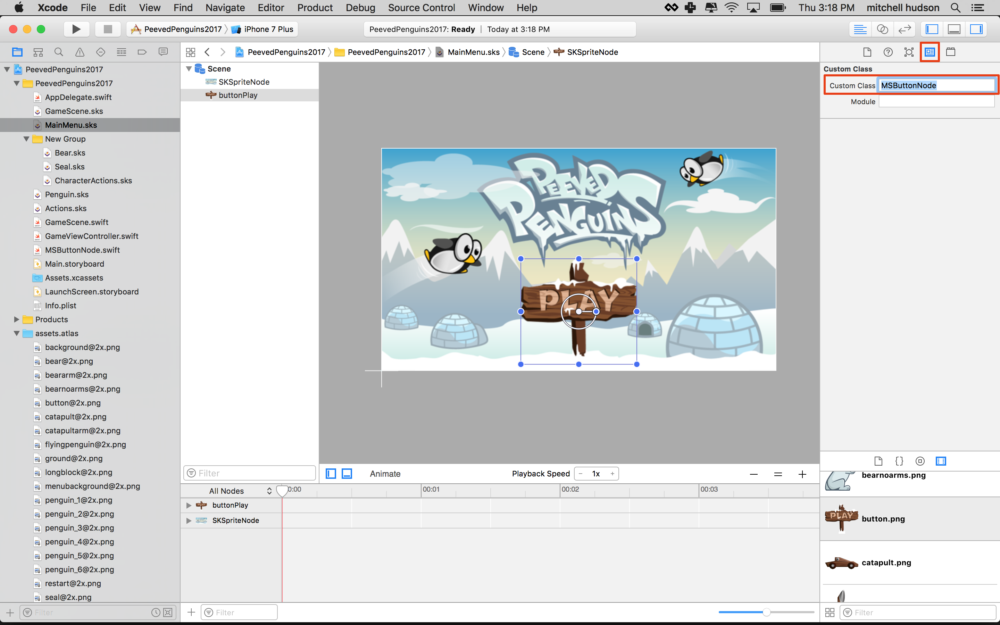
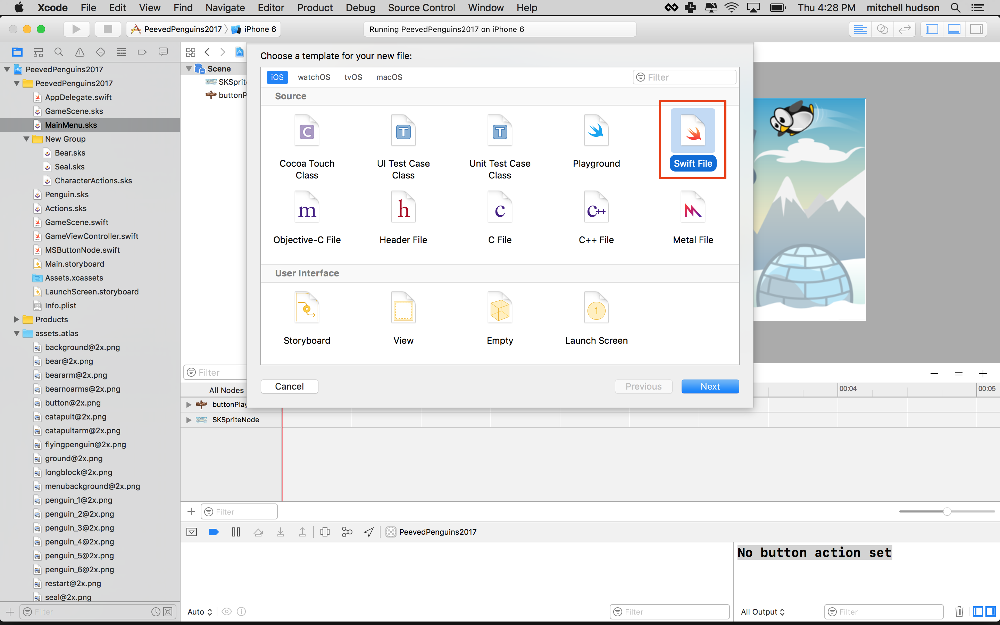
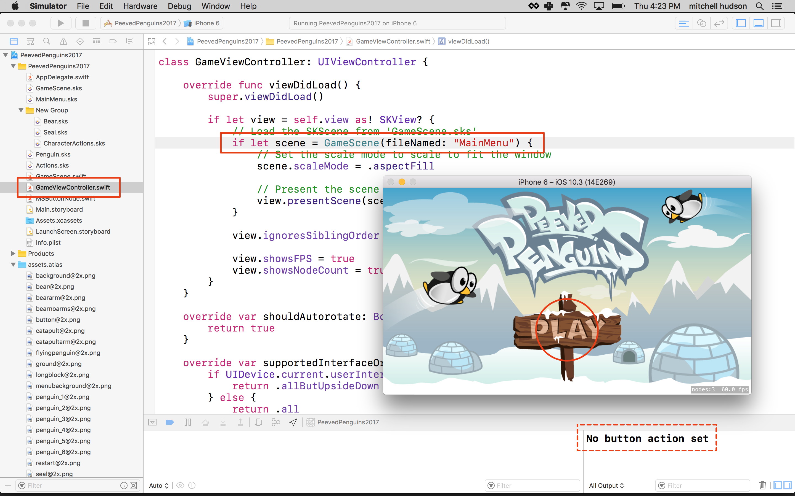

Now you are going to setup a main menu screen. This start menu will then lead 
the player into the game play scene that you will develop in the next chapter.

The scene will be made of two parts:

1. MainMenu.swift - contains all of the code that controls the scene.
2. MainMenu.sks - is a visual editor that that holds all of the objects in the scene.

# Adding the Main Scene

You are going to create a new *Scene* for the main menu.

> [action]
> Create a new SKS file (`File > New > File > SpriteKit Scene`) and name it `MainScene.sks`
> Set *Scene Size* to `(568,320)`
>
> 
>

## Adding the background

> [action]
> Drag *menubackground.png* to the scene and snap it to the bottom-left corner.
> Set *Z-Position* to `-1` to ensure the background is always at the back.
>
> 

## Add MSButtonNode

Add the MSButtonNode class to your project. If you've improved the *MSButtonNode* class 
in the *Hoppy Bunny Tutorial* and made it epic. Please feel free to reuse your copy in 
this project.

> [action]
> [Download MSButtonNode.swift](../MSButtonNode.swift) and drag the file into your project, 
> ensuring *Copy items if needed* is checked.
>

# Creating the play button

The main menu needs a play button to trigger the transition into the *GameScene*.

> [action]
> SpriteKit does not provide any button objects, so you will need to use our assets as you 
> did in the *Hoppy Bunny Tutorial*.
> Drag *button.png* into the scene, place it wherever looks good to you.
> Then set the name of the button to `buttonPlay`. 
>
> 
>
> Now create a code connection to link this button to your code. Set the 
> the *Custom Class* to `MSButtonNode`:
>
> 
>

## Coding the main scene

Let's add a new *MainMenu.Swift* file to facilitate functionality for 
*MainMenu.sks*.

> [action]
> Create a new empty Swift file (`File > New > File > Swift File`) and name it 
> `MainMenu.swift`
> Ensure your new class reads as follows
>
> 
>
```
import SpriteKit
>
class MainMenu: SKScene {
>    
    /* UI Connections */
    var buttonPlay: MSButtonNode!
>    
    override func didMove(to view: SKView) {
        /* Setup your scene here */
>      
    }
}
```
>

This code creates the code connection for the button and sets up the *selectedHandler* 
to launch your *GameScene* when the button is touched.

# Launching the Main Scene

By default a new game project will load the *GameScene*, you need to change this to 
load *MainMenu* instead. The entry point or your game is `GameViewController.swift`. 

> [action]
> Open *GameViewController.swift* and modify the following line inside `viewDidLoad()`:
>
```
if let scene = SKScene(fileNamed: "GameScene") {
```
> Replace with:
```
if let scene = MainMenu(fileNamed: "MainMenu") {
```

The `viewDidLoad()` method in `GameViewController` is called when this view controller 
appears on the screen, at which time we load the first scene: `MainMenu`. 

Here you created an instance of *MainMenu.swift* which is an `SKScene`. When loading a Scene 
you can also load it with a sks file using `SKScene(fileNamed:)`. In this case you used: 
`MainMenu(fileNamed: "MainMenu")` to create an instance of MainMenu (from MainMenu.swift)
with the `MainMenu.sks` scene. 

Run your game...



If the Simulator shows your game in portrait choose Hardware > Rotate Right 
(or Command+Right-arrow)

Looks good, you can even touch the button. However, it doesn't do anything other than 
print: "No button action set".

Run the project...

You should now be able to touch the **Play** button and be presented with an empty 
*GameScene*.

# Summary

You've learned to:

- Implement multiple scenes
- Change the default launch scene
- Create a custom button and launch another scene

In the next chapter you will building the game scene.
