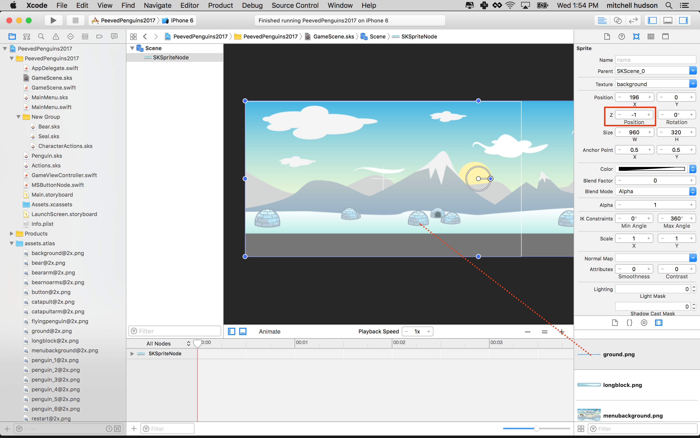
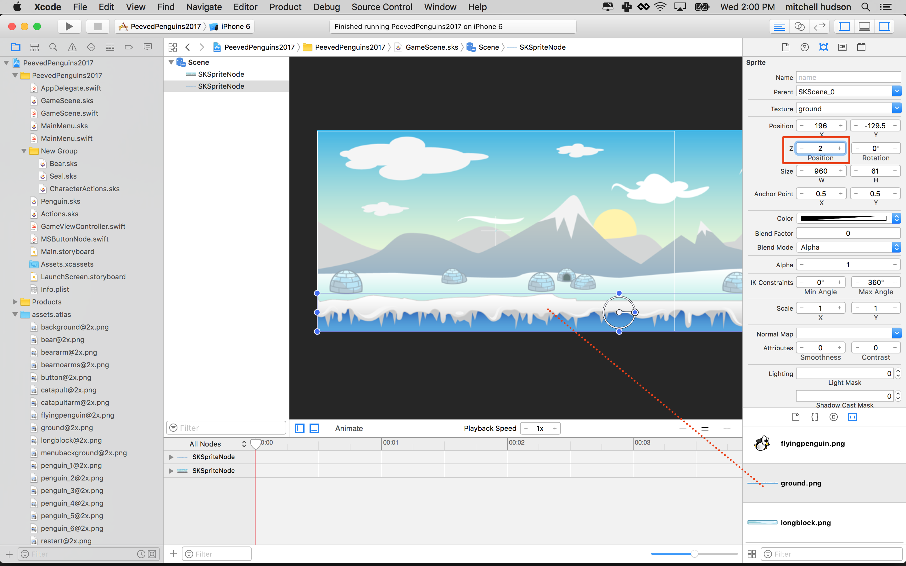
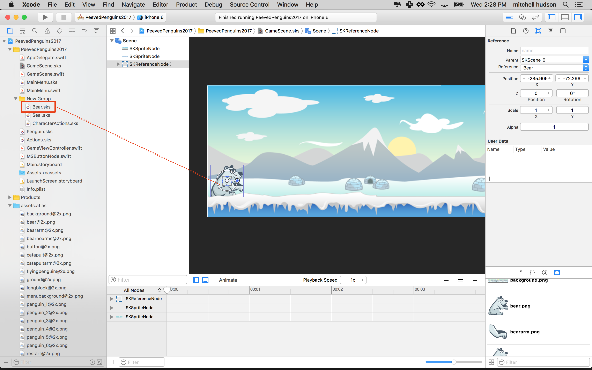
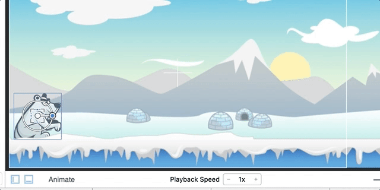
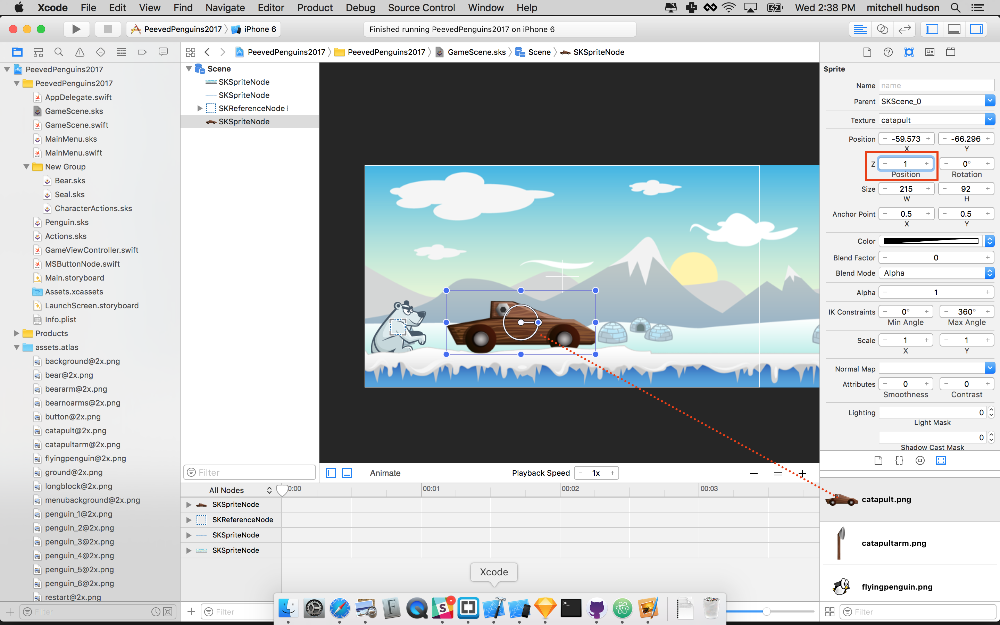
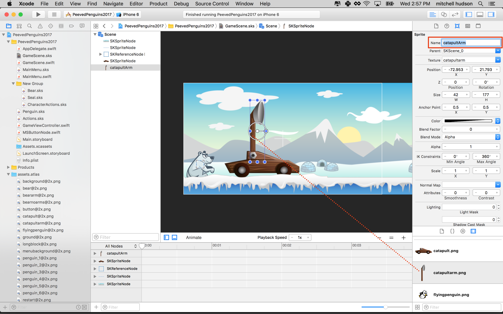
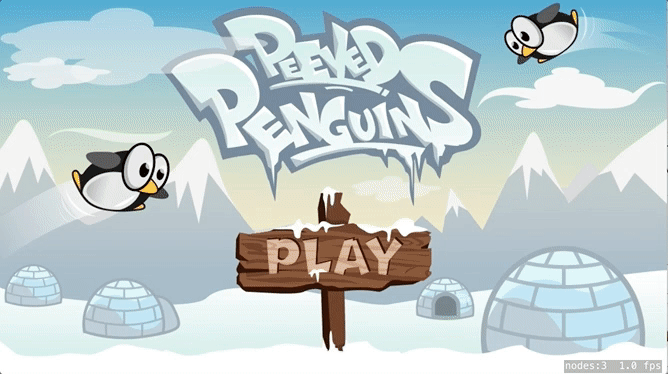
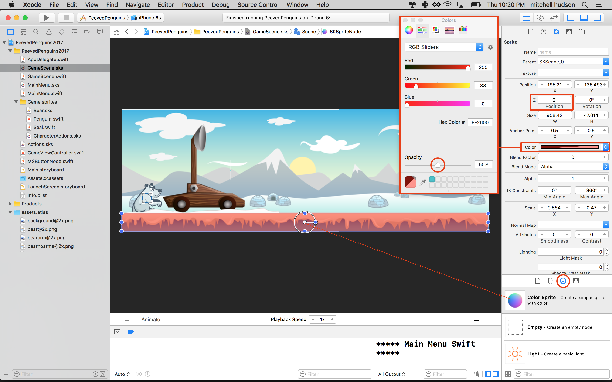
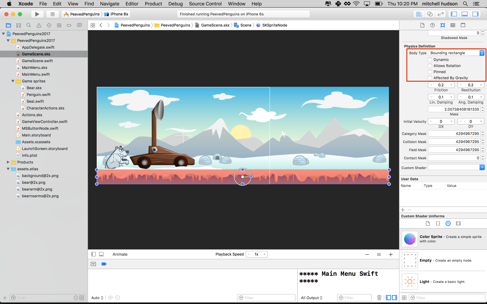
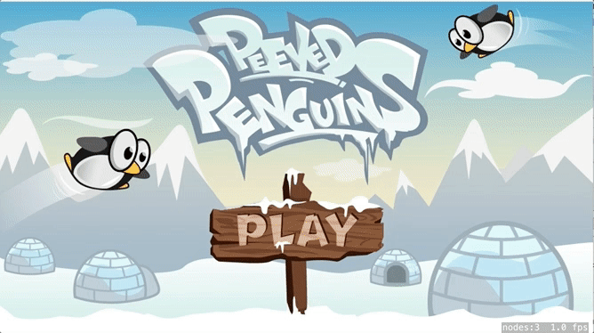

Now it's time to start working on the good stuff, you're going to 
construct *Penguin Launcher 0.1 Beta*

# Setup the game scene

> [action]
> Open *GameScene.sks* and set *Size* to `(568,320)`
>
> Delete any objects that may have been created in the default project.
>
> Drag *background.png* onto the stage, snap to the bottom-left and set 
> the *Z-Position* to `-1`.
>



> Drag *ground.png* onto the stage, snap to the bottom-left and set the 
> *Z-Position* to `2`, you want the ground to be in the foreground as 
> some objects such as the catapult will sit between the ground and the 
> background
>



Remember the first game object you made? You will be adding the 
animated *Bear.sks* to the scene. SpriteKit lets you reference **.sks** 
files in other **.sks** files using a *SKReferenceNode*. This is a 
**super powerful** feature, and you will make extensive use of it.

> [action]
> Open *GameScene.sks* and drag the *Bear.sks* from the *Project 
> Navigator* scene and place it ontop of the ground near the bottom-left.
> 



Click on the **Animate** button to see your bear taunting.



## Adding a catapult

> [action]
> Drag *catapult.png* to the stage and set the *Z-Position* to `1` as 
> you want the arm to sit behind the main body of the catapult.



> Drag *catapultArm.png* to the stage and set *Name* to `catapultArm` 
> as you will want to create a code connection for the arm later.
>



Run your game... Tapping the Play button should load the GameScene showing the catapult 
and bear. 



# Penguin launcher model 1

Before modeling catapult physics we are going to implement a simple 
shooting mechanism to learn a bit more about projectile physics.

Time for your to connect the catapult arm, spawn penguins and launch 
them into the stratosphere.

> [action]
> Open *GameScene.swift* and replace the contents with:
>
```
import SpriteKit
>
class GameScene: SKScene {
>    
    /* Game object connections */
    var catapultArm: SKSpriteNode!
>    
    override func didMove(to view: SKView) {
        /* Set reference to catapultArm node */
        catapultArm = childNode(withName: "catapultArm") as! SKSpriteNode
    }
>    
    override func touchesBegan(_ touches: Set<UITouch>, with event: UIEvent?) {
        // Make a Penguin
        let penguin = Penguin()
>        
        // Add the penguin to this scene
        addChild(penguin)
>        
        /* Move penguin to the catapult bucket area */
        penguin.position.x = catapultArm.position.x + 32
        penguin.position.y = catapultArm.position.y + 50
    }
>    
    override func update(_ currentTime: CFTimeInterval) {
        /* Called before each frame is rendered */
    }
}
```
>

Here, with each tap, you are creating an instance of the Penguin class you created in 
the previous module when you tap the screen. You also position that new penguin instance 
32 points to the right of the catapult arm, and 50 points up from the catapult arm. 

Run your game...


Great, the penguin spawns at the catapult, but sadly it falls out of the game world.

## Ground physics

Let's enable physics on the **ground** this will give the penguins a surface to 
bounce on. 

The ground could be used as to determine a physics body. The shape of the image is not a 
rectangle making it a poor choice. It's best for us to use circles and rectangles for 
physics bodies whenever possible. THe circle is the most effecient shape followed by the 
rectangle. 

For best results you will draw a color sprite in where the ground should be. You can 
later set the color to a transparent color. 

The ground will be a static (not dynamic) physics body. 

> [solution]
> Open `GameScene.sks`. Drag 'Color Sprite' into the scene. Set the 'z-position' to 2. 
> Then resize the Color Sprite to fit over thhe ground. Last, set the color to something 
> Transparent. I left mine partially transparent for testing, you can make it 0% 
> transparent when you happy everything is working correctly. 
> 
> 
>
> Now set the physics properties for the new 'ground' sprite. Choose 'Bounding Rectangle'
> from the physics menu (you may have scroll down in the properties inspector). The 
> ground will be a static object, that is it won't move. Uncheck Dynamic, Allows rotations, 
> and Affected by gravity. 
> 
> 
>

Run your game... It's a bit more fun, see how many penguins can you add ? :]

## Adding a little impulse

It would be nice to add a little impulse to the penguin. Imagine the penguin is being 
hit by an invisible baseball bat. An impulse is a one time push on a vector. You 
set the strength of the impulse on the x and y. 

> [action]
> In *GameScene.swift* add the following to the end of the `touchesBegan(...)` method:
>
```
/* Impulse vector */
let launchImpulse = CGVector(dx: 200, dy: 0)
>
/* Apply impulse to penguin */
penguin.physicsBody?.applyImpulse(launchImpulse)
```
>

First your setup the force vector with a direction `(200,0)` e.g X = 200 (Right)

> [info]
> If you need a little recap on vectors, this diagram illustrates the direction of the 
> vector `(400,0)`
>
> 
>

Next you multiple this by `200` to ensure you hit the penguin with enough force to make 
it really fly! Please feel free to play with these values.

Run your game... Your penguins should hopefully fly across the screen now.



# Summary

Your game is starting to come to life, you've learnt to:

- Build a simple game scene
- Construct a simple catapult
- Dynamically adding new penguins to the scene
- Applying impulse in a specific direction to launch the penguin

In the next chapter you will design your first game level.
