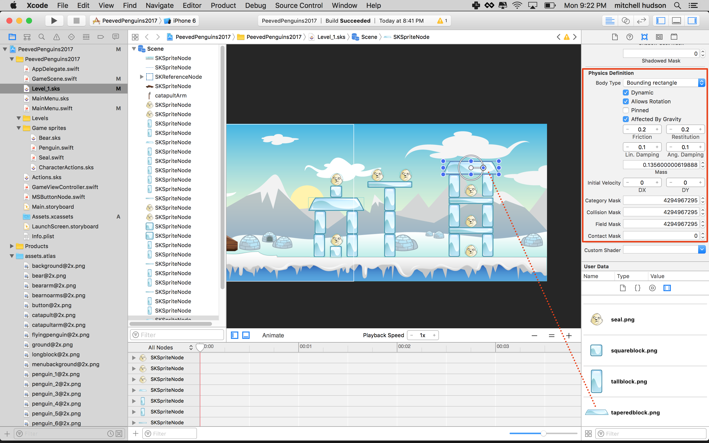
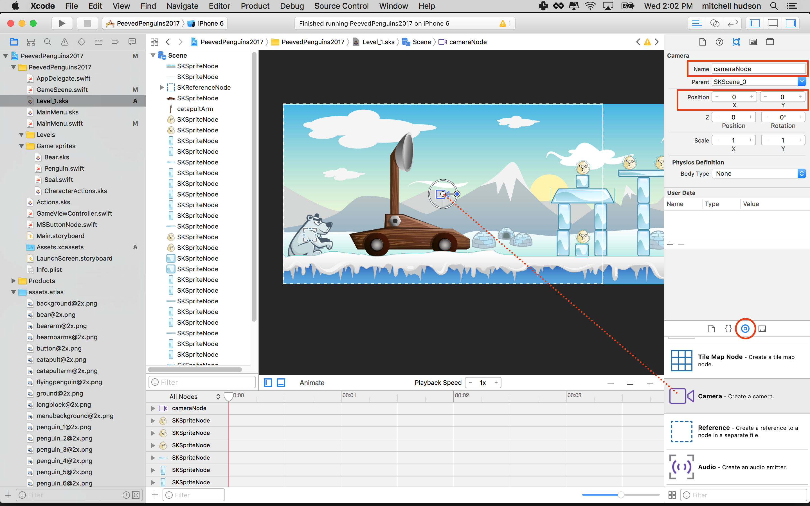
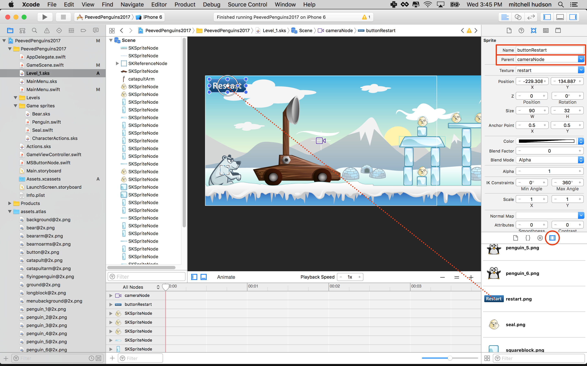

Launching penguins is fun. However, colliding with seals and ice blocks is a game!
Time to design the first level.

## Level loading mechanism

You want to be able to create any number of different levels without having to create
duplicate code for each level. A SKScene (.swift file) object can be can be loaded with any scene (.sks)
file. This allows you to create mulitple .sks files and load any of them with the same SkScene
object. *GameScene.swift* for example could be instantiated with `Level_1.sks` or `Level_2.sks`.

*GameScene.swift* contains the game logic that runs the game. This file contains the
definition for a class named `GameScene`, which sublcasses `SKScene`. An `SKScene` can
be initialized with an .sks file via the init(fileNamed:) initializer.

Our strategy will be to create an .sks file for each level of the game. This will allow
you to create each scene level (.sks file) in the visual editor. You will load each level.sks file
with the same `GameScene.swift`.

*GameScene.swift* will keep the same name, for organization let's rename the game levels
as `Level_#.sks` where # will be the level number. For example:

- `Level_1.sks`
- `Level_2.sks`
- `Level_3.sks`
- etc.

# Level 1

> [action]
> Rename *GameScene.sks* to `Level_1.sks`
>

You will use this file as the template for all of your other levels. You will set this
level up and test with it. Later you can duplicate this file to easily make new levels.

# Designing a level

The level is made from the default elements: ground, catapult, bear, and level specific
elements: Ice Blocks, and Seals. You'll make the your first level by adding Ice Blocks
and Seals.

The Ice Blocks and Seals need to be Physics objects, so you'll need to set those options.
After creating the first Ice Block or Seal you can copy it to create another with the
same settings.

> [action]
> Design your own level by dragging Ice Blocks and Seals into the scene.
>
> For *Seals*, choose Physics Body: "Bounding Circle", Category Mask: 2, Contact Mask: 1.
>
> For *Ice Blocks*, choose Physics Body: "Bounding Rectangle". Leave the other options at
> the default values.
>
> 
>
> Be sure to place some blocks inside the frame on the right. The camera doesn't move yet
> so anything outside the frame will not be visible, for now.
>
> 
>

Testing at this point will produce *no results!* Fear not and read on...

# Level loading code

You need to add a function that will load any level. Previously we were loading
'GameScene.sks'. You've renamed that file to `Level_1.sks`. You need to set up
`GameScene.swift` to load the renamed scene, or any scene named `Level_#` where #
is any integer.

> [action]
> Open *GameScene.swift*
> Add this new method:
>
```
/* Make a Class method to load levels */
class func level(_ levelNumber: Int) -> GameScene? {
    guard let scene = GameScene(fileNamed: "Level_\(levelNumber)") else {
        return nil
    }
    scene.scaleMode = .aspectFill
    return scene
}
```
>

# Load Level 1

Now load the Level 1.

> [action]
> You need to modify code you used to load `GameScene`. Find the block of code
> below in *MainMenu.swift* inside `loadScene()` method.
>
```
/* 2) Load Game scene */
guard let scene = GameScene(fileNamed: "GameScene") else {
    print("Could not make GameScene, check the name is spelled correctly")
    return
}
```
>
> The line: `GameScene(fileNamed: "GameScene")` is loading `GameScene.swift` with
> 'GameScene.sks'. You no longer have 'GameScene.sks' you renamed it `Level_1.sks`.
> You also added a new class method to load levels with a number. Change this look
> like this:
>
```
/* Load Game scene */
guard let scene = GameScene.level(1) else {
    print("Could not load GameScene with level 1")
    return
}
```
>

# Test some penguins

Test your project in the simulator and tap the screen. penguins should lay waste to the
Seals and Ice Blocks.


# Scrolling the scene

Now that you can shoot penguins, let's improve the experience by tracking the penguin in
flight across the level. SpriteKit features a *SKCameraNode* that lets you view the
scene through this virtual camera.

## Add the camera

A camera object gives us point of view through which we can view the scene. With a camera
you can follow objects and zoom in and out of a scene. The `SKCameraNode` is a subclass
of `SKNode`.

> [action]
> Add a camera to the scene. Open `Level_1.sks` add a camera node from the Object Library.
> Set the position to `(0, 0)`, and the name to "cameraNode".
>



Create a camera by defining a variable and creating a new instance of `SKCameraNode`.

> [action]
> Open *GameScene.swift*, add the following at the top of the `GameScene` class:
>
```
/* Define a var to hold the camera */
var cameraNode:SKCameraNode!
```
>

Next get a reference to the cameraNode and assign this camera to the scene.  

> [action]
> Add the following to `didMove(to view:)`.
>
```
/* Create a new Camera */
cameraNode = childNode(withName: "cameraNode") as! SKCameraNode
self.camera = cameraNode
```
>

Testing now everything should look the same as before. Even though things look the same
the scene is now being viewed from the camera. You can test this out for yourself. Try
the code below.

This should zoom the scene out.

`cameraNode.setScale(2)`

Or, this should zoom in.

`cameraNode.setScale(0.5)`

You dont't want to zoom in or out, at least not yet. For now what you want to do is
follow the penguin with the camera. Much of the scene is off camera to the right.
When the penguin flies out of view we can't see what's happening.

To make this happen you will set the position.x of the camera to the position.x of
current penguin. This has the potential to move the camera out of bounds on the left or
the right. To do this you can 'clamp' the value. Clamp is a function that takes a value,
min, and max. It might look like this:

`clamp(value: 50, min: 100, max: 200)`

In this case clamp returns 100 since the value is less than min. Swift provides a clamp
method but despite this you will have write your own. To understand why you'll have to
understand how Swift works with numbers.

## Numbers - Int, Float, Double, and CGFloat

Numbers in Swift can be different types. There are Doubles, Floats, Ints and more.
Double represents a 64-bit floating-point number. Float represents a 32-bit floating-point number.
A CGFloat is like a Double but can be 32-bit when the operating system only supports 32-bit. This
allows CGFloat to be optimized for graphics processes. *SpriteKit* uses CGFloat for almost everything
that is a number.

While Swift has a clamp() funtion that works with Int, Float, and double.
There is no clamp function that takes a CGFloat! You will have to make your own!

> [action]
> Add this new function *outside* of your `GameScene` class in *GameScene.swift*.
>
```
func clamp<T: Comparable>(value: T, lower: T, upper: T) -> T {
    return min(max(value, lower), upper)
}
```
>

This function takes in any *comparable* of Type T for `value`, `lower`, and `upper`. It
returns a Type T that is the maximum value between the value and the lower value,
and the minimum value between that and the upper value.

In short this function can take in any type, including CGFloat!

> [info] A *comparable* is any
> class that comforms to the *comparable* protocol. Comparables are any Type that can be
> compared using relational operators: >, <, <=, and >=. Read more about
> [comaprables here](https://developer.apple.com/reference/swift/comparable).
>

<!-- -->

> [info] Think of *T* in the function above as standing in for any Type that fits the description.
> This is called a *generic*. Using a *generic* here allows this function to receive
> different Types instead of a single fixed type.
> [Read more about Swift generics here](https://developer.apple.com/library/content/documentation/Swift/Conceptual/Swift_Programming_Language/Generics.html).

## Camera Target

You need to have a target for the camera to follow. This may exist or may not exist
so you can make it an optional. In other words there may be a Penguin for the camera
to follow, or there may not be a Penguin for the camera to follow.

> [info] *Optionals* are variables that may have a value or they may have no value in which case their value is *nil*.
>
> [Read more about optionals here](https://medium.com/ios-os-x-development/swift-optionals-78dafaa53f3).

<!-- -->

> [action]
> Add the following at the top of the `GameScene` class.
>
```
/* Add an optional camera target */
var cameraTarget: SKSpriteNode?
```

<!-- -->

Now set the `cameraTarget` when you make a new Penguin.

> [action]
> Add the following at the end of the `touchesBegan(_ touches: with event:)` method:
>
```
cameraTarget = penguin
```

The questionmark (?) after the type declares `cameraTarget` as an *optional*.

> [action]
> Add a function that will make the camera follow the camera target.
>
```
func moveCamera() {
    guard let cameraTarget = cameraTarget else {
        return
    }
    let targetX = cameraTarget.position.x
    let x = clamp(value: targetX, lower: 0, upper: 392)
    cameraNode.position.x = x
}
```

This function check if if `cameraTarget` is `nil`, Remember to check for nil on optionals that may not contain a value or you end up crashing your game! Using `guard` if
`cameraTarget` is `nil` we end the function with `return`. Otherwise we get the x position of
`cameraTarget` and set the x position of the `cameraNode` to the x position of the camera
target.

> [action]
> Find the `func update(_ currentTime:)` method in the `GameScene` class. Add a call to `moveCamera()` to the end.

Test your work. Should look something like this:


Notice the last penguin flies out of view on the right. The camera follows the penguin
but doesn't move past the right edge of the scene. This is the effect of clamp! When the
x position of the penguin is greater than `392` clamp limits the `x` value to `392`, the
upper bound.

If the penguin were to somehow fly off the left side of the screen it's x value would
be less than 0, and clamp would limit the camera x to 0, the lower bound.

Try changing the upper value and launching some penguins off the right side.

# Restarting the level

Now that the player can demolish a level, it also would be great for them to be able to
restart the game. Let's add a button to reset the level.

You will implement this much like we did for the **Main Menu** using the *MSButtonNode*
class.  

> [info]
> If you finding yourself needing to create button graphics, I made the *restart.png*
> with aptly titled [Da Button Factory](http://dabuttonfactory.com/)
>

Add the restart button to the *GameScene.sks*

> [action]
> Open `Level_1.sks` and drag the *restart.png* onto stage. I would recommend putting
> it near the top left corner. Set *Name* to `buttonRestart` and set *Custom Class*
> to `MSButtonNode`.
>

Run your game... Fire some Penguins. Notice the restart button is stuck in the upper
left corner, and it disappears when the camera moves off the right. It would be nice if  
button moved with the camera so it was always available on screen. You can make this
happen by setting the button's parent to the camera.

> [action]
> Select the *Restart button* and set *Parent* to `cameraNode`.



The next step is to run some code that will reload this scene when you tap the *restart
button*. Can you do this yourself? Consult the *play button* in `MainMenu` and look at
`didMove(to view:)` in `GameScene`. Here are the steps:

- Declare a `var` for buttonRestart
- Set the reference in `didMove(to view:)`
- Define a block of code to run in the button's `selectedHandler`
- Create a new scene with `GameScene.level(n)`
- Present the scene

> [solution]
> Open *GameScene.sks* and add the code connection property to the *GameScene* class:
>
```
/* UI Connections */
var buttonRestart: MSButtonNode!
```
>
> Add the connection to the `didMove(to view:)`:
>
```
/* Set UI connections */
buttonRestart = childNode(withName: "//buttonRestart") as! MSButtonNode
```
>
> Still in `didMove(to view:)` add the `selectedhandler` to restart the *GameScene*:
>
```
/* Reset the game when the reset button is tapped */
buttonRestart.selectedHandler = {
    guard let scene = GameScene.level(1) else {
        print("Level 1 is missing?")
        return
    }
>    
    scene.scaleMode = .aspectFill
    view.presentScene(scene)
}
```
>

Great! Run your game... Your **Restart button** should be fully operational.


# Summary

Congrats! This is starting to look like an actual game.
You learnt to:

- Build a dynamic level loading mechanism
- Design your first level
- Using *SKCameraNode* and tracking a node
- Adding a restart button

In the next chapter you are going to learn how to take the physics to the next level and
model a catapult.
